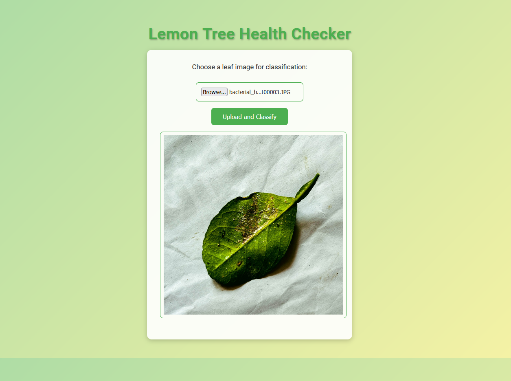
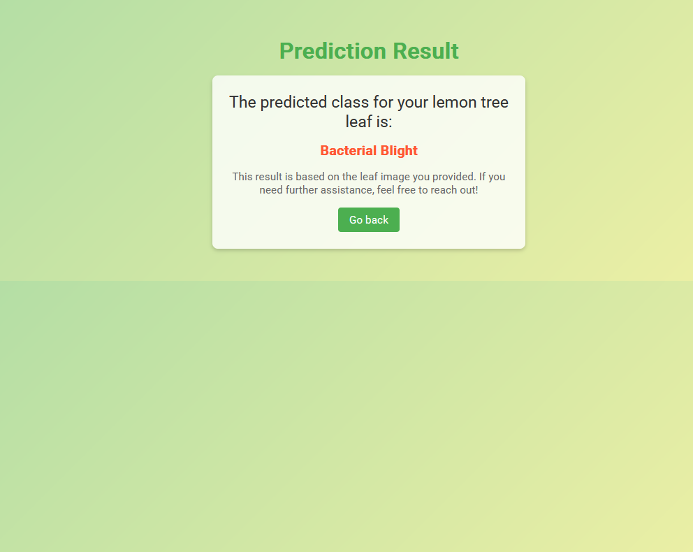

# Lemon Leaf Disease Classification: A CNN Powered Web App in Docker

The Lemon Leaf Disease Classification App is an innovative web application powered by a Convolutional Neural Network (CNN), deployed via Docker. This app enables users to upload an image of a lemon leaf and receive a classification of the leaf into one of the following categories:
* Anthracnose
* Bacterial Blight
* Citrus Canker
* Curl Virus
* Deficiency Leaf
* Dry Leaf
* Healthy Leaf
* Sooty Mould
* Spider Mites

With an accuracy rate of 96.8%, the app utilizes deep learning to analyze leaf images, providing quick and accurate disease identification.

Dataset used: https://www.kaggle.com/datasets/mahmoudshaheen1134/lemon-leaf-disease-dataset-lldd

## Benefits of the App

This tool provides a valuable service to the agriculture sector by:

* Enabling Early Disease Detection: Early identification of plant diseases allows for timely intervention, reducing the spread of harmful conditions and saving crops.
* Improving Crop Management: Farmers and researchers can take proactive measures to treat or manage diseases, contributing to healthier plants and improved yields.

## Frontend

## How to run the website without Docker:

1 - Download the repository 
2 - Open VSC and run the file Convolutional Neural Network to Predict Sicknesses in Lemon Leaves.ipynb. 
This is necessary in order to create and save the model.keras file. Ideally, this step would not be part of the instruccions, but the model was too large to upload to github, and this is the only workaround possible.
3 - Install Dependencies: Use the requirements.txt file to install the required libraries: pip install -r requirements.txt
4 - Run the Application: by writting in the terminal python server.py
5 - Access the Web App: Open your browser and go to: http://127.0.0.1:8000

## How to run the website using Docker:

